```{r knitr_init, echo=FALSE, cache=FALSE}
library(knitr)
library(rmdformats)

## Global options
options(max.print="75")
opts_chunk$set(echo=FALSE,
	             cache=TRUE,
               prompt=FALSE,
               tidy=TRUE,
               comment=NA,
               message=FALSE,
               warning=FALSE)
opts_knit$set(width=75)
```


# Introduction

ICCAT has asked the SCRS to evaluate a Harvest Control Rule (HCR) for North Atlantic albacore using Management Strategy Evaluation. Work started on the [MSE](http://iccat.int/Documents/CVSP/CV070_2014/n_5/CV070052096.pdf)  in 2013 when advice was provided in the form of a [HCR](http://iccat.int/Documents/CVSP/CV070_2014/n_3/CV070031355.pdf) with target and limit reference points. This HCR was then simulation tested using an Operating Model (OM) based on [Multifan-CL](http://iccat.int/Documents/CVSP/CV070_2014/n_3/CV070030717.pdf).

The code used to conduct the MSE is available from a public [github repository](https://github.com/iccat-mse/albn), and uses the [FLR](http://www.flr-project.org/) libaries written in R.

The stock is to be [reassessed](http://iccat.int/Documents/0992-16_ENG.PDF) in 2016 and in light of this new assessment the Commission shall review the results of the MSE conducted so far and make adjustments to the HCRs as required [(Rec-015-04)](http://iccat.int/Documents%5CRecs%5Ccompendiopdf-e%5C2015-04-e.pdf).

# MSE

Conducting an MSE requires six main steps 

1. Identification of management objectives and mapping these to performance measures to quantify how well they are achieved;
2. Selection of hypotheses about system dynamics for building an Operating Model (i.e. a simulation model of the resource being managed).
3. Building the simulation models, i.e. conditioning the OM on data and knowledge, and possible rejection of and weighting of  different hypotheses.
4. Identifying alternative management strategies, i.e.the combination of pre-defined data, stock assessment methods and reference points and HCRs, and coding these up as Management Procedures.
5. Running the simulations using the HCRs as feedback control procedures; and
6. Agreeing the Management Strategies that best meet management objectives.

## Management Objectives

The objectives of the Commission are outlined in Rec-15-05, which require  ensuring that the stock is neither overfished or subject to overfishing. In addition average catches should be maximsed and inter-annual fluctuations in TAC levels minimised. 

## Operating Model

The Operating Model, represent the simulated versions of reality. 

It is necessary to condition the Operating Model on data and knowledge for a range of hypotheses about the resource dynamics. There are many ways to do this, one is to use the the currently-used stock assessment model as in this case where the Operating Model is based on the North Atlantic albacore Multifan-CL integrated assessment (SCRS/2016/023). 

Although many important processes can not be parameterised using a stock assessment model. if a Management Procedure can not perform well when reality is as simple as implied by an assessment model, it is unlikely to perform adequately for more realistic representations of uncertainty.

See SCRS/2016/023 for a full description of the OM based on the Multifan-CL scenarios. Here some of the figures from that document are provide to summarise the OM. 


### Production functions

Age based assessments have a production function, the production functions are shown by Multifan-CL scenario. It can be seen that they are all skewed, i.e. B_{MSY}<0.5B_{0}. This is mainly due to high steepness of the stock recruitment relationship.

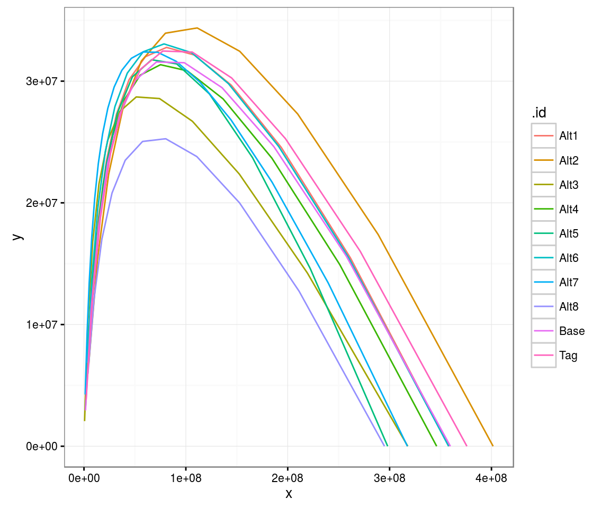
**Time series** of SSB relative to $B_{MSY}$ by Multifan-CL scenario


### OM Time Series

The time series of SSB relative to $B_{MSY}$ are plotted by scenario. While there are differences in level, the overall trends and fluctuations are similar.

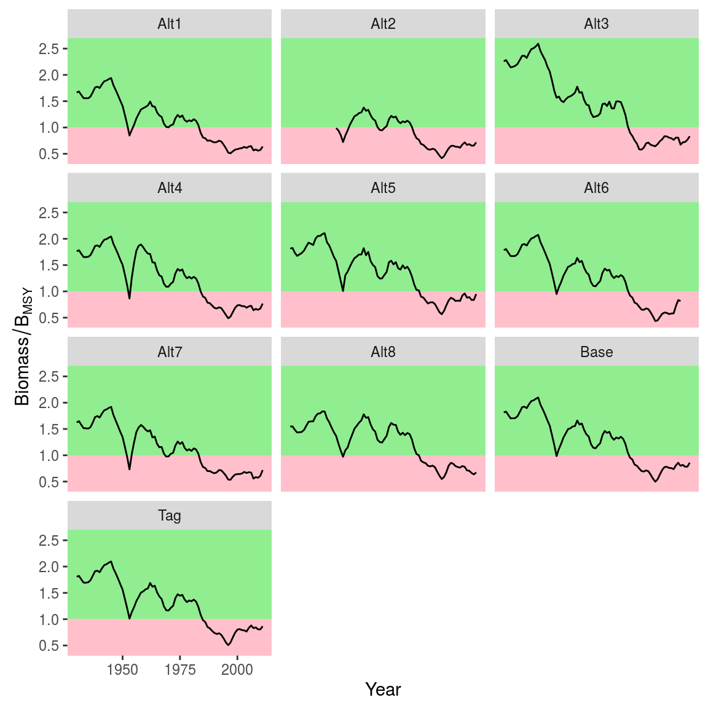
**Time series** of SSB relative to $B_{MSY}$ by Multifan-CL scenario.

Time series of the various MSY benchmarks, stock status relative to the benchmarks, and production function parameters (from Multifan-CL) and plotted. The time series were derived by using a moving average (5 years) for recruitment and selection pattern. 

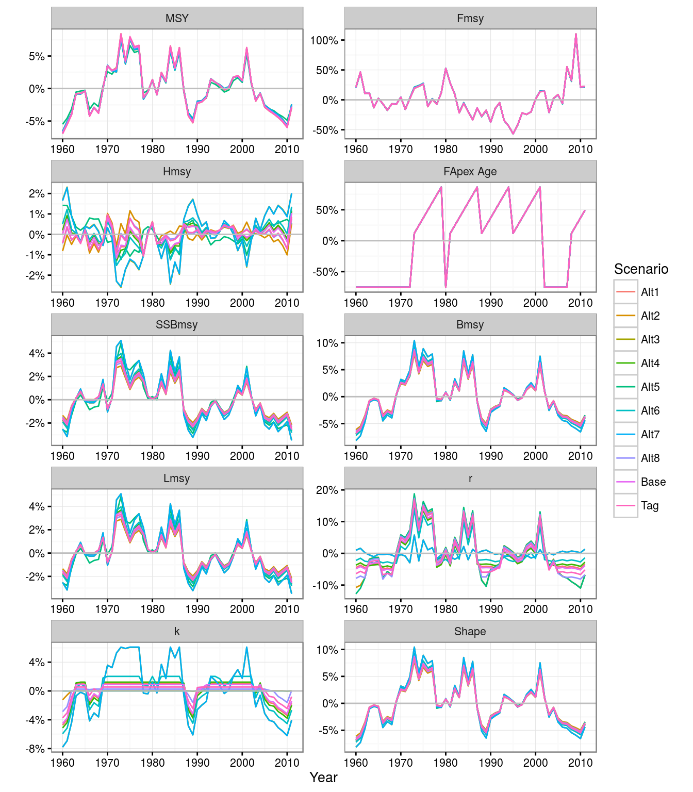
**Time series** MSY benchmarks, stock status relative to the benchmarks, and production function parameters by Multifan-CL scenario (lines).


The most variable quantity is $F_{MSY}$, this due to the ICCAT practice of using $F_{apex}$ to calculate $F_{MSY}$. $F_{apex}$ is the F-at-age in an F vector which is the highest; this mixes exploitation level and selection pattern.  In comparison $H_{MSY}$ based on harvest rate is much more stable, making it a more reliable index of productivity.

### Stationarity

To evaluate changes in productivity, the time series of recruitment are plotted next. A sequential T-test (blue boxes) was conducted to identify changes in mean level and variance. In all cases it appears that in the mid period recruitment was more variable and high.

In an age based model like Multifan-Cl process error is modelled via recruitment. The time series of production ($B_{t+1} - B_t + C_t$) are plotted next along with a sequential T-test.

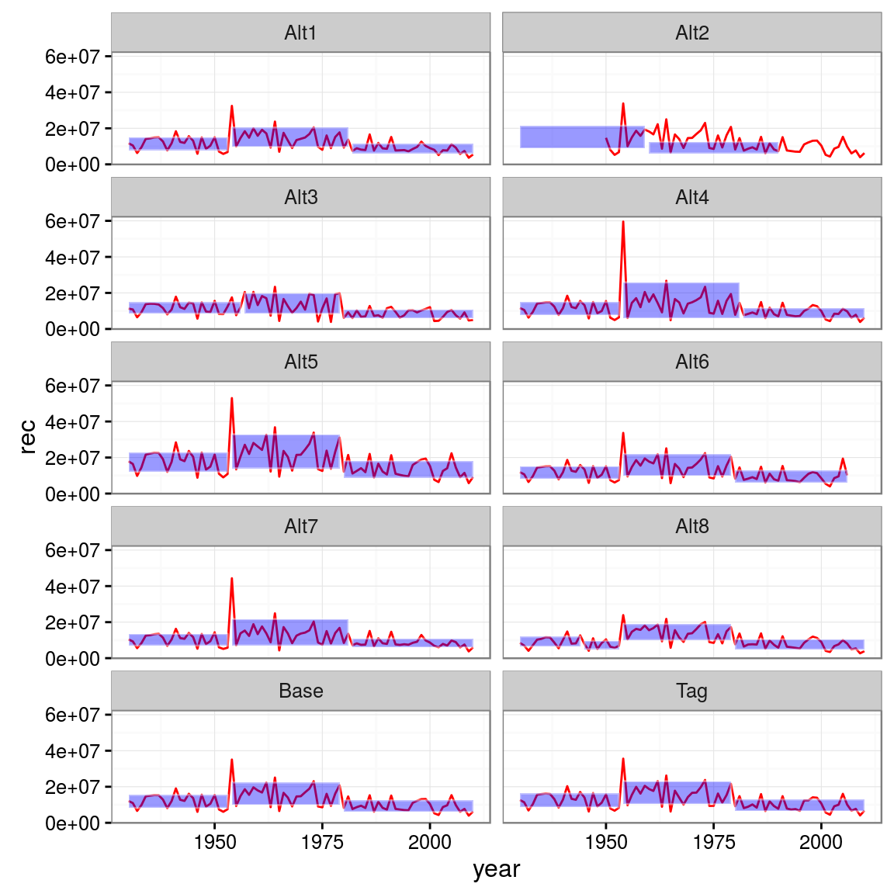
**Time series** of recruitment by Multifan-CL scenario

Production is highly variable and driven by strong year-classes.

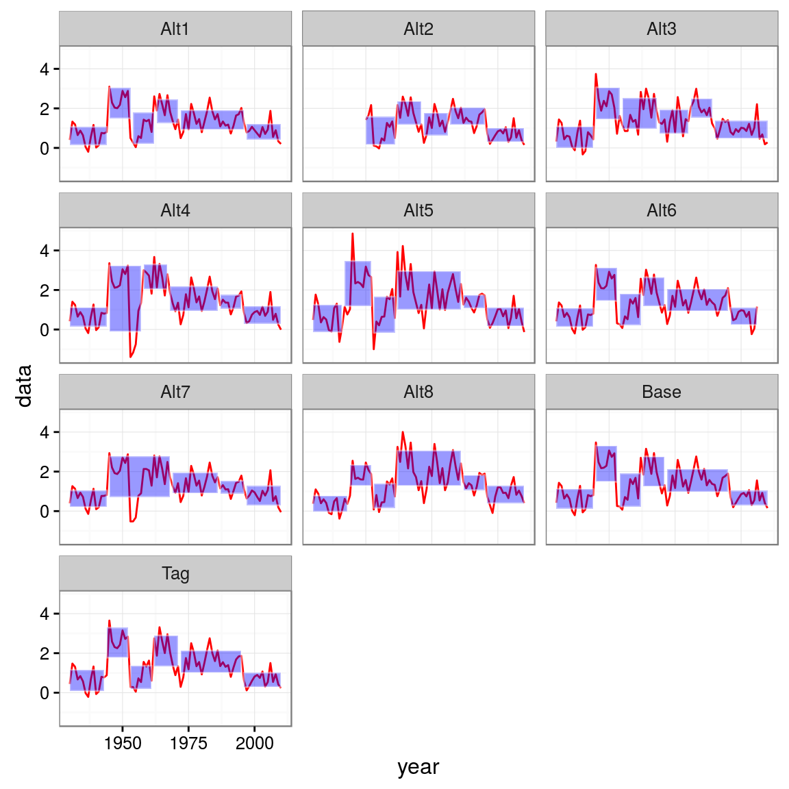
**Time series** of productivity by Multifan-CL scenario


### OEM

The Operating Model is used to simulate resource dynamics to evaluate the performance of a Management Procedure. Where the Management Procedure is the combination of pre-defined data, together with an algorithm to which such data are input to provide a value for a management control measure. 

To link the Operating Model and the Management Procedure it is necessary to develop an Observation Error Model to generate fishery-dependent or fishery-independent resource monitoring data. The Observation Error Model reflects the uncertainties, between the actual dynamics of the resource and perceptions arising from observations and assumptions by modelling the differences between the measured value of a resource index and the actual value in the Operating Model. 

The Management procedure used was a biomass dynamic stock assessment model that used time series of catch biomass and indices of relative abundance. The Observation Error Model is described in SCRS/2016/024.

Simulations were performed for a variety of assumptions i.e. i) unbiased, ii) hyperstability, iii) trend in catchability, iv) auto-correlation, v) a decrease in variance with time, vi) an index based on juvenile age-classes, vii) index based on mature age-classes, and viii) index based on numbers. 

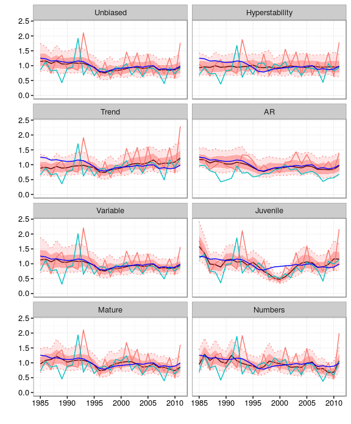
**Time series** simulated indices of abundance.

## Management Strategies

Management Strategy Evaluation simulation tests strategies implemented as Management Procedures using the Operating Model. The Management Procedure is the combination of pre-defined data, together with an algorithm (e.g. a stock assessment procedure) to which such data are input to provide a value for a management control measure. The intention is to demonstrate, through simulation trials, robust performance of the Management Procedure in the presence of uncertainties. 

Once candidate management strategies are identified these have to be coded up as a Management Procedure. Simulation is them used to identify the Management Procedure that robustly meet management objectives. 

SCRS/2016/025 describes the implicit North Atlantic albacore Management Procedure. While SCRS/2016/026 performed a cross test using the Operating model in non-feedback mode, i.e. to generate data so that the biomass model could be fitted and the estimates compared to the Operating model values. SCRS/2016/027  validated assessment software used in the Management procedure and SCRS/2016/028 proposed a generic procedure to check the reliability of the assessment procedure by a working group.

### Stock Assessment

The logistic production function is probably not appropriate for many species (e.g. due to high steepness, and a Pell-Tomlinson form with B_{MSY}<0.5B_0 was used. Assuming logistic in the assessment, when in reality the function is asymmetric can also cause problems in bimodality. If you have data from the RH limb of the curve, i.e. when you are in the green K2PP and base your assessment on those data and a logistic curve. Then you get more data from the red quadrant and still assume logistic the curve will flip, i.e. you are now fitting to the LH limb. 

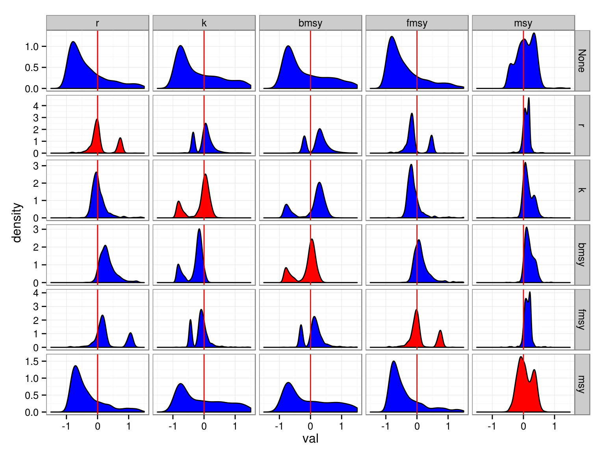
**Posterior distribution** estimated by the biomass dynamic assessment model, relative to te OM value (red line); rows correspond to the prior used in the assessment. 

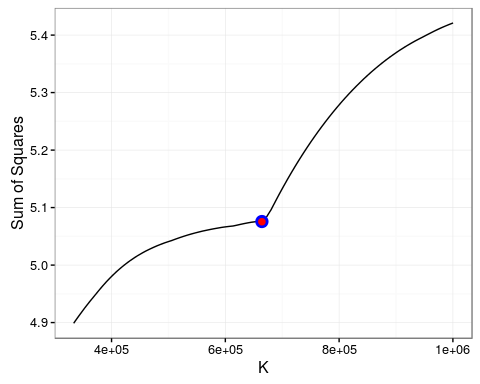
**Likelihood profile** showing solution (red & blue dots) are not at a global minumum.


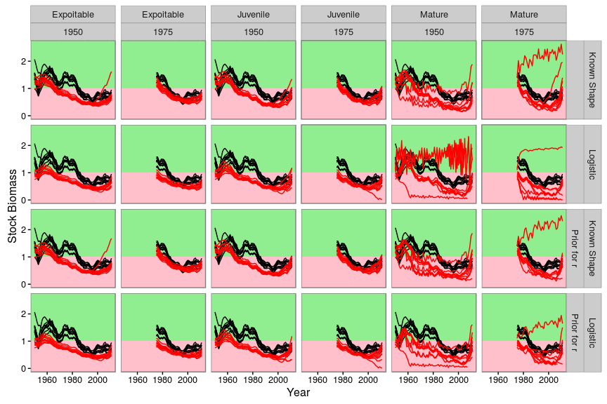
**Time series** of SSB relative to $B_{MSY}$ by OM scenario (black) and estimates made by stock assessment (red). Columns show the properties of the CPUE index (i.e. ages selected and starting year); rows show the assessment assumptions.

The best performing assessments are when the data are truncated, the juvenile and the expoited biomass index perform equally well. Getting the right shape of the production function is also important

In srcs-2016-023 it was shown that that there are regime shifts and recruitment generated long-term fluctuations due to process error which caused problems, 

This is again shown in 023 & 027 (cross testing). So truncating performs better than using the total time series. Which has been shown using simulation.

### Harvest Control Rule

Demonstation of a Harvest Control Rule. 

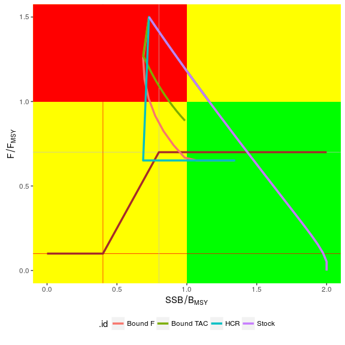

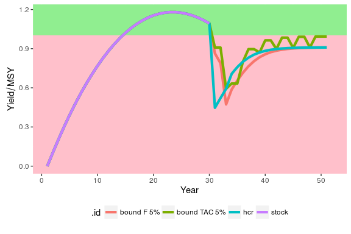


## Agreeing

A main problem is that the MSE and WG assessment are running in parallel, when they should converge. We cant simulation test the 2013 assessment as it is unstable and unreliable, however, the MSE runs perfectly. Why is the MSE so good? because we have tested the Stock Assessment (SA) method and made it robust! What to do? Use the knowledge we now have about what makes an assessment robust (i.e. reliable and stable) and then transfer that knowledge into conducting the assessment, which we then simulation test in the MSE.

# Bibliography
